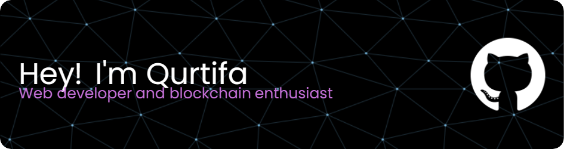
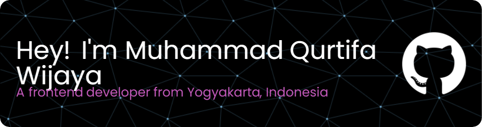

<h1 align="center">Hi 👋, I'm Muhammad Qurtifa Wijaya</h1>
<h3 align="center">A passionate frontend developer from Yogyakarta, Indonesia</h3>

<!--

  

-->

  

## 🏆 GitHub Trophies

- 👯 I’m looking to collaborate on **any web development projects**

- 📝 I regularly write articles on [https://medium.com/@muhammadqurtifa](https://medium.com/@muhammadqurtifa)

- 💬 Ask me about **React or Laravel**

- 📫 How to reach me **contact@qurtifa.me**

- ⚡ Fun fact **my hobby is Photography**

## Connect with me :

  
  
  
  
  
  
  

## Languages and Tools :

  
  
  
  
  
  
  
  
  
  
  
  
  
  
  
  
  
  
  
  
  
  
  
  
  
  
  
  
  
  
  
  
  
  
  
  
  
  
  
  
  
  
  
  
  
  
  
  
  
  
  
  
  
  
  
  
  
  
  
  
  
  
  
  
  
  
  

###

## 📊 GitHub Stats :

  
   
  
  

 

  

---
## ✍️ Random Dev Quote

  

---

