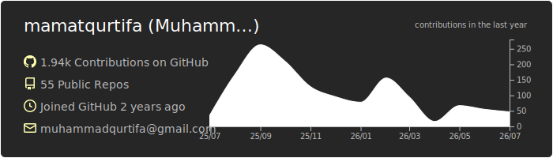
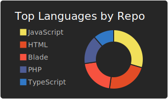
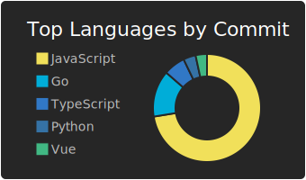
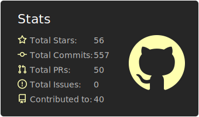
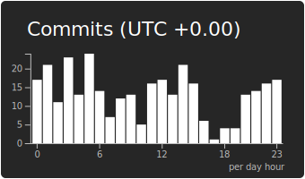

  

  

## About Me
I am Muhammad Qurtifa Wijaya, a Full-Stack Developer with a strong passion for both modern web development and reliable server infrastructure. As a student majoring in Sistem Informasi Jaringan dan Aplikasi (Network and Application Information Systems) at SMK Negeri 2 Depok Sleman, I specialize in building responsive applications using React.js, Next.js, Laravel, and Tailwind CSS, and I am actively expanding my expertise into Vue.js and Nuxt. Beyond writing code, I have a deep interest in DevOps. I connect development and deployment by managing virtual private servers. I have learned Docker and AWS, including AWS Lambda, CloudWatch, EC2, ECS, RDS, and other AWS ecosystem services, and I use GitHub Actions. I have also learned the basics of Ansible, am familiar with Ubuntu and Debian Linux, and am comfortable using Git and Nginx. I am currently deepening my DevOps knowledge.

## Latest Blog Posts
<!-- BLOG-POST-LIST:START -->
- [Memahami Perbedaan API, REST API, dan RESTful API](https://qurtifa.my.id/blog/perbedaan-api-rest-restful) - February 14, 2026 - Web Development
- [Tutorial JSON Web Token (JWT) Auth Di Laravel 12 Untuk Pembuatan API 2026](https://qurtifa.my.id/blog/jwt-auth-laravel-api-2026) - February 13, 2026 - Laravel
- [Server Hardening - Part 5: Monitoring & Incident Response](https://qurtifa.my.id/blog/server-hardening-debian-ubuntu-part-5) - February 12, 2026 - Security
- [Server Hardening - Part 4: System Hardening](https://qurtifa.my.id/blog/server-hardening-debian-ubuntu-part-4) - February 12, 2026 - Security
- [Server Hardening - Part 3: Application Security](https://qurtifa.my.id/blog/server-hardening-debian-ubuntu-part-3) - February 12, 2026 - Security
<!-- BLOG-POST-LIST:END -->

## GitHub Trophies

## Tech Stack
### Fullstack

  
  
  
  
  
  
  
  
  
  
  
  
  
  
  
  
  
  
  
  
  
  
  
  
  
  
  

### DevOps

  
  
  
  
  
  
  
  
  
  
  
  
  
  
  
  
  
  
  
  
  
  
  
  
  
  
  

## Connect with me :

  

## GitHub Stats

  <table>
    <tr>
      <td>
        
      </td>
    </tr>
  </table>

  <table>
    <tr>
      <td>
        
      </td>
      <td>
        
      </td>
    </tr>
  </table>

  <table>
    <tr>
      <td>
        
      </td>
      <td>
        
      </td>
    </tr>
  </table>

<!-- ## 📊 GitHub Stats :

  
   
  
  

 

  

---
## ✍️ Random Dev Quote

  

--- -->

<picture>
  <source media="(prefers-color-scheme: dark)" srcset="https://raw.githubusercontent.com/mamatqurtifa/mamatqurtifa/pacman-output/pacman-contribution-graph-dark.svg">
  <source media="(prefers-color-scheme: light)" srcset="https://raw.githubusercontent.com/mamatqurtifa/mamatqurtifa/pacman-output/pacman-contribution-graph.svg">
  
</picture>

